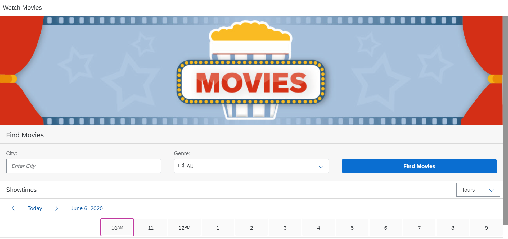

# Movie-Application

A simple web application to show you the available movies and there show timing. This project was part of the course [Developing web apps with SAP UI5](https://open.sap.com/courses/ui51).

## SAPUI5?

Client-side JavaScript library for creating Web user interfaces its all run inside your browswer using java script code.

## Screenshot of the To-Do-List App

### Movie App

### Installation Process

Follow the instructions for the SAPUI5 environment Setup given [here](https://help.sap.com/viewer/977416d43cd74bdc958289038749100e/1.0/en-US/f8cbb7a89f1143c7a64d22372208d1ec.html).

Import the project in the WEB IDE environment and run the index.html file to start the application.

## Project Admin

|  |
| :----------------------------------------------------------: |
| **[Chetan Paliwal](https://www.linkedin.com/in/Chetanpaliwal22/)**  |

 
